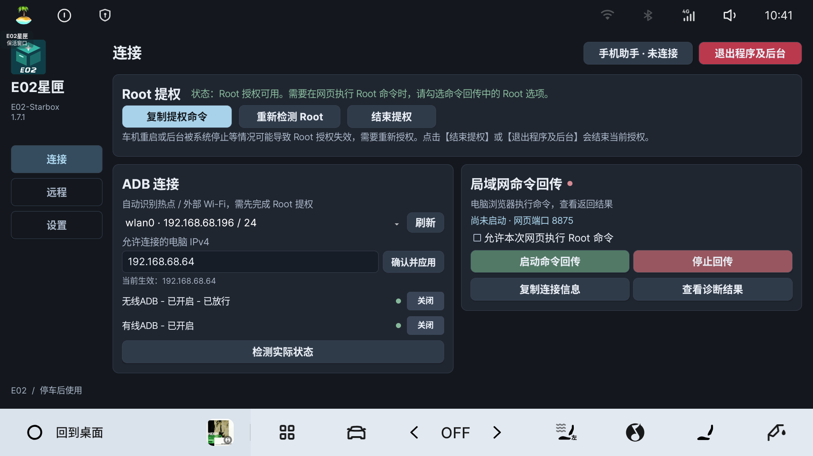

# E02星匣 · E02-Starbox

面向银河 E02 / 星舰 7 的轻量车机工具。提供 ADB 连接、命令回传、FRP 远程连接、手机输入与复制同步、悬浮窗截图和版本更新。

**免费、开源，不对外出售，不收取软件使用费用。项目方未授权任何个人或机构销售本软件。**

**当前版本：v1.7.3**

修复部分 Flyme Auto 车机更新安装闪退，更新提醒更简洁，下载不畅时可自动测试镜像站。

[下载 v1.7.3 安装包](https://github.com/BerryFuwawa/E02-StarBox/releases/download/v1.7.3/E02-Starbox-v1.7.3.apk) · [使用指南](docs/使用指南.md) · [更新说明](docs/1.7.3更新说明.md)

## 第一次使用

1. 下载并安装 APK，打开后阅读风险告知。使用官方旧版的用户可直接覆盖安装，已有设置保留。
2. 需要修改 ADB 或截图时，在「连接」页点击「复制提权命令」，按照弹窗使用 EVCC 或应用管家执行，再返回点击「重新检测 Root」。
3. 手机与车机连接同一可互通网络，点击顶部「手机助手」扫码配对。手机可填写星匣输入框、发送文字到车机剪贴板、接收复制内容。
4. 电脑与车机在同一网络时，填写电脑 IPv4，点击「确认并应用」，再开启无线 ADB；不同网络使用「远程」页配置 FRP。

Root 功能需要 EVCC 或应用管家本身已能执行 Root 命令。安装星匣不会自动获得 Root。

## 功能教程

| 想做什么 | 教程 |
| --- | --- |
| 授权 Root、用手机填写 Token 或接收复制内容 | [Root 授权与手机助手](docs/教程/Root授权与手机助手.md) |
| 连接无线／有线 ADB、使用网页执行命令 | [ADB 与命令回传](docs/教程/ADB与命令回传.md) |
| 从其他网络访问车机网页和 ADB | [FRP 远程连接](docs/教程/FRP远程连接.md) |
| 查看新版本、测试镜像站与安装更新 | [版本更新](docs/教程/版本更新.md) |
| 悬浮窗截图、更新、初始化、常见问题 | [完整使用指南](docs/使用指南.md) |

## 界面

左侧为「连接、远程、设置」三个页面。点按悬浮窗返回主界面，长按截图到下载文件夹，拖动移动。

## 适用范围

主要验证环境：2025 星舰 7 / E02，Flyme Auto 2.5.0，Android 9，1920×1080。其他车型和系统版本可能存在差异。

车机休眠、重启或系统清理后台后，授权和连接可能失效，需要重新打开并启动相应功能。热点切换、车机流量和长期后台连接尚未完成充分测试。详见[兼容性与使用须知](docs/版本验证范围.md)。

请仅在车辆停稳、安全驻车时操作。高权限和自定义命令可能造成数据丢失、车机异常、系统损坏或影响售后权益；首次使用会显示完整风险告知。

## 开源与反馈

本项目采用 MIT 许可证。FRP 0.71.0 用于远程连接，内置 Android ARM / ARM64 frpc；ZXing Core 3.5.3 用于离线生成二维码，来源及许可证见 [third_party](third_party)。Windows frpc 需自行从 [FRP 官方 Releases](https://github.com/fatedier/frp/releases/tag/v0.71.0) 下载。

开发者可参考[编译说明](docs/编译说明.md)和[界面设计规范](docs/界面设计规范.md)。

问题反馈请使用 [Issues](https://github.com/BerryFuwawa/E02-StarBox/issues)，注明车型、系统版本、星匣版本和复现步骤；不要公开 Token、穿透密钥或有效连接码。
