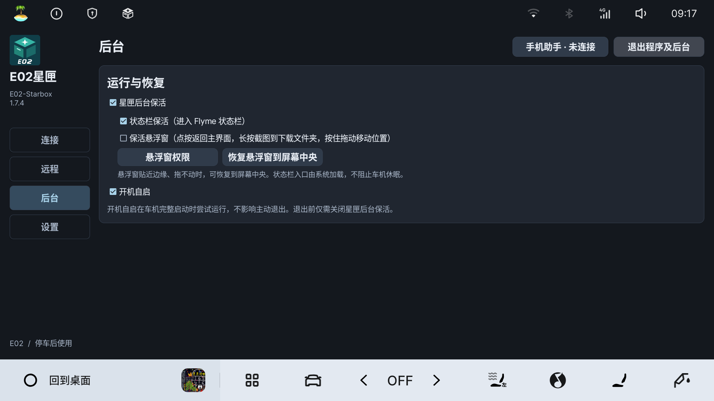

# E02星匣 · E02-Starbox

面向银河 E02 / 星舰 7 的轻量车机工具，提供 ADB 连接、网页命令回传、FRP 远程连接、手机输入与复制同步、后台入口和悬浮窗截图。

**免费、开源，不对外出售，不收取软件使用费用。项目方未授权任何个人或机构销售本软件。**

**当前版本：v1.7.4**

新增打开软件时自动连接内网穿透，后台功能集中到独立页面；优化配置选择，修复车机缺少文件选择器时的导入闪退。

[下载 v1.7.4 安装包](https://github.com/BerryFuwawa/E02-StarBox/releases/download/v1.7.4/E02-Starbox-v1.7.4.apk) · [使用指南](docs/使用指南.md) · [更新说明](docs/1.7.4更新说明.md)

## 第一次使用

1. 下载并安装 APK，阅读首次风险告知。官方旧版可覆盖安装，已有设置保留。
2. 在「连接」点击「启用独立授权」并确认。车机本机已有可用的 Root ADB 时，星匣可建立自己的 Root 服务。原厂未开放 Root 的设备无法仅靠安装星匣获得 Root。
3. 手机与车机处于同一可互通网络时，点击顶部「手机助手」扫码配对，填写长配置或同步复制内容。
4. 同一网络下，填写允许连接的电脑 IPv4 并点击「确认并应用」，再开启无线 ADB；跨网络访问使用「远程」配置 FRP。
5. 在「后台」设置状态栏入口、悬浮窗与开机自启；远程连接确认可用后，可开启「软件打开自启内网穿透」。

## 功能教程

| 想做什么 | 教程 |
| --- | --- |
| 启用 Root 授权、手机填写 Token 或接收复制内容 | [Root 授权与手机助手](docs/教程/Root授权与手机助手.md) |
| 连接无线／有线 ADB、网页执行命令 | [ADB 与命令回传](docs/教程/ADB与命令回传.md) |
| 从其他网络访问车机网页和 ADB | [FRP 远程连接](docs/教程/FRP远程连接.md) |
| 设置后台入口、自动连接和退出 | [后台与自动连接](docs/教程/后台与自动连接.md) |
| 检查新版、测试镜像站、安装更新 | [版本更新](docs/教程/版本更新.md) |

左侧固定「连接、远程、后台、设置」四个页面。点按悬浮窗返回主界面，长按截图到下载文件夹，按住拖动移动。

## 适用范围

主要验证环境：2025 星舰 7 / E02，Flyme Auto 2.5.0，Android 9，1920×1080。其他车型或系统版本可能存在差异。

车机休眠、重启或系统清理后台后，授权和连接可能失效。本版暂不提供熄火后远程保活；完整开机自启、热点切换与长期后台连接仍需进一步验证。详见[兼容性与使用须知](docs/版本验证范围.md)。

请仅在车辆停稳、安全驻车时操作。高权限和自定义命令可能造成数据丢失、车机异常、系统损坏或影响售后权益，首次使用会显示完整风险告知。

## 开源与反馈

本项目采用 MIT 许可证。FRP 0.71.0 用于远程连接，内置 Android ARM / ARM64 frpc；ZXing Core 3.5.3 用于离线生成二维码，来源及许可证见 [third_party](third_party)。Windows frpc 请从 [FRP 官方 Releases](https://github.com/fatedier/frp/releases/tag/v0.71.0) 下载。

开发者可参考[编译说明](docs/编译说明.md)和[界面设计规范](docs/界面设计规范.md)。

反馈请使用 [Issues](https://github.com/BerryFuwawa/E02-StarBox/issues)，注明车型、系统版本、星匣版本和复现步骤；不要公开 Token、穿透密钥或有效连接码。
