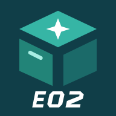
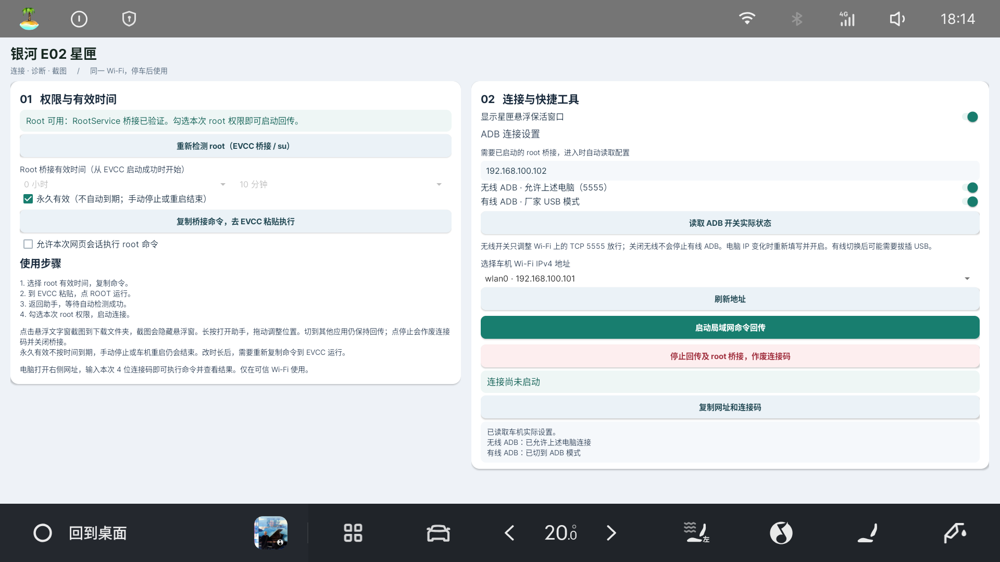
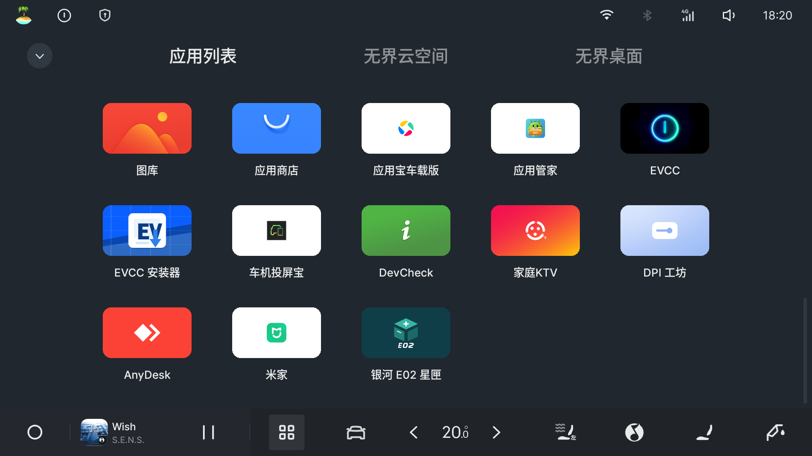
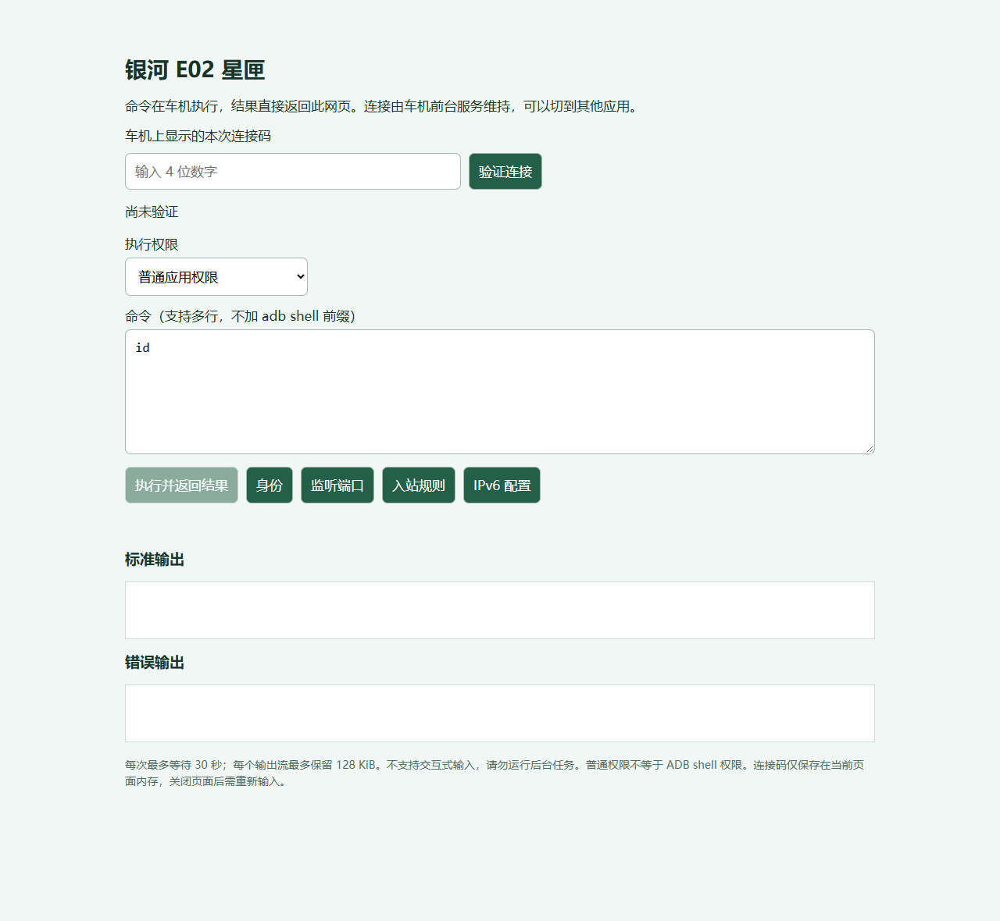

# 银河 E02 星匣

**银河 E02 星匣**，用于星舰 7 车机的电脑连接、命令回传和快捷截图。

已在 **2025 款星舰 7 · Flyme Auto 2.5.0 · Android 9** 上使用验证。当前版本 **1.5.1**。

**[下载安装包](https://github.com/BerryFuwawa/Galaxy-E02-tools/releases/download/v1.5.1/Galaxy-E02-Starbox-v1.5.1.apk)** · [使用指南](docs/使用指南.md)

## 软件截图

### 车机主界面

v1.5.1 实车截图。

### 车机应用列表

### 电脑网页终端

## 可以做什么

- 电脑与车机连接同一 Wi-Fi，在网页里执行命令并查看结果。
- 四位连接码，支持选择普通权限或 root 权限。
- root 使用时间可选小时、分钟，也可勾选永久。
- 独立开关无线 ADB 和有线 ADB。
- 小型半透明悬浮窗，支持拖动、点击截图和长按返回软件。

## 开始使用

1. 安装软件，让电脑和车机连接同一个 Wi-Fi，允许悬浮窗权限。
2. 选择 root 使用时间，点击 **复制桥接命令，去 EVCC 粘贴执行**。
3. 打开 **EVCC → 终端**，在左下 **自定义命令** 的 **命令** 输入框粘贴，点击 **Root 执行**。
4. 返回 **银河 E02 星匣**，点击 **重新检测 root（EVCC 桥接 / su）**。
5. 检测成功后，按需勾选 **允许本次网页会话执行 root 命令**，点击 **启动局域网命令回传**。
6. 在电脑浏览器打开软件显示的网址，输入四位连接码，即可执行命令。

详细操作见 [使用指南](docs/使用指南.md)。软件需要已有的 root 执行工具；安装本软件不会自动获得 root。

## 悬浮窗操作

| 操作 | 功能 |
| --- | --- |
| 点击 | 截图保存到车机下载文件夹，图片中不显示悬浮窗 |
| 长按 | 返回助手 |
| 拖动 | 调整位置 |

## 获取软件

在 [版本下载页](https://github.com/BerryFuwawa/Galaxy-E02-tools/releases/tag/v1.5.1) 下载 **Galaxy-E02-Starbox-v1.5.1.apk** 并安装到车机。桌面图标名称为「银河 E02 星匣」。已有同签名版本可覆盖安装。

需要自行构建，见 [编译说明](docs/编译说明.md)。

请在停车时、可信 Wi-Fi 下使用。停止回传后，连接码失效；永久授权在手动停止或车机重启后结束。

## 许可

[MIT](LICENSE)
