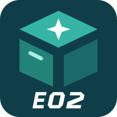
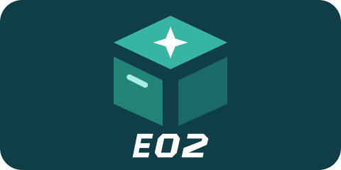

# v1.7.1 图标更新

沿用原有 E02 标识，只修改图标边缘和卡片背景。方形图标四周改为圆角；长方形资源保持与图标同色，标识居中，避免四周出现白色留边。

以上为原始资源预览，并非车机截屏。实际卡片由车机桌面决定，资源已配置到应用及主界面；用户选择稍后手动下载、覆盖安装，Flyme Auto 应用选择器的实际显示待此后核对。

最终安装包仍为 v1.7.1 / versionCode 11，原包名和原签名，大小 11814291 bytes，SHA-256 `a8ba65016af75bb42bbc864cfb5e80ca0cdc7e692106dbe917042595abfd6405`。编译、签名和 APK 内资源读取已通过。

此前 Root 置顶版本的功能与布局回归记录保留在 [布局调整](1.7.1布局调整.md) 和 [验证记录](1.7.1验证记录.md)。本次仅改变图标资源及声明；DEX 与 assets 均和已实车验收的功能包完全一致。最终图标包的实车覆盖安装由用户稍后手动执行，结果另行记录。

GitHub 发布已获用户批准；EVCC 只预填草稿，发布需用户再次审核。
