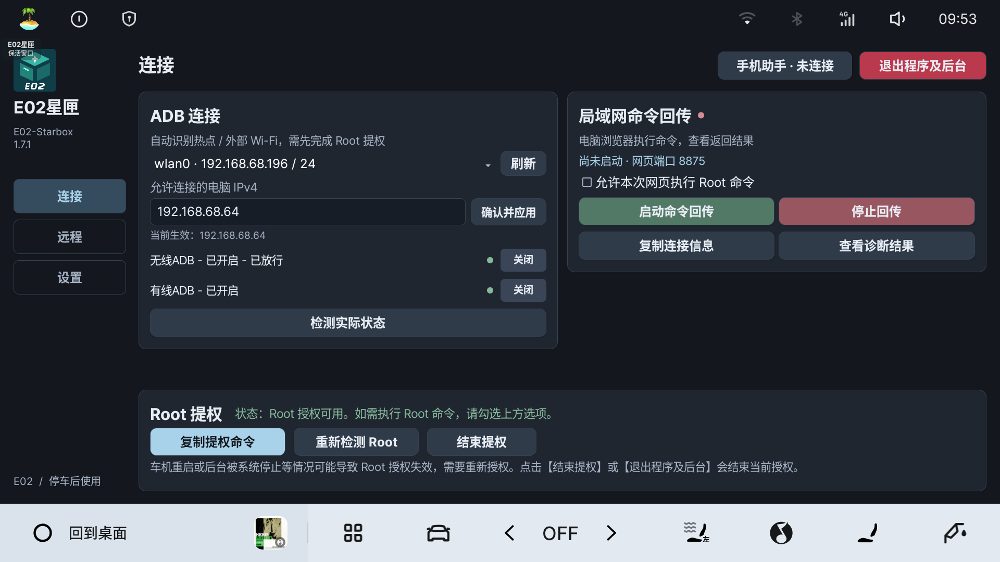
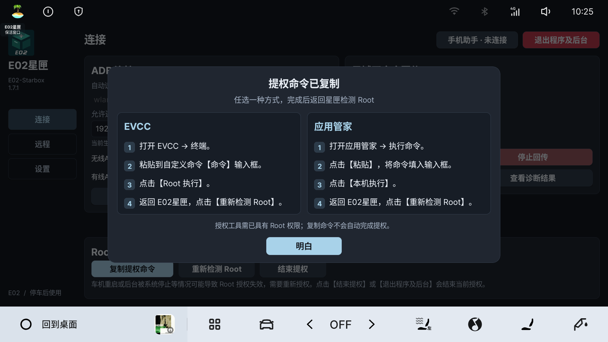
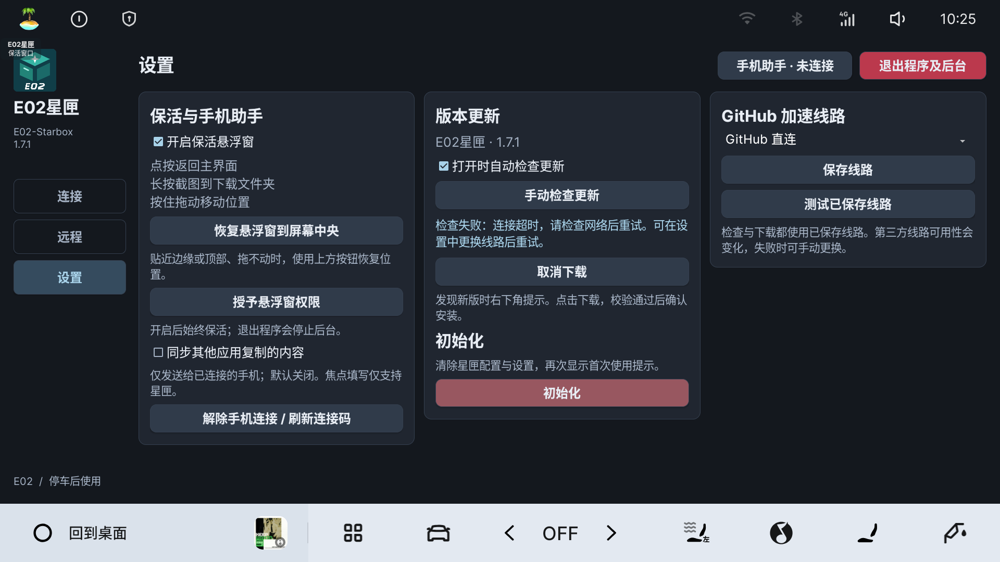

> 最新布局构建及其 APK 哈希见 [连接页布局调整](1.7.1布局调整.md)；下文记录的是布局调整前的完整功能回归。

# E02星匣 v1.7.1 验证记录

2026-10-08。本地交付，尚未上传 GitHub 或发布 Release。

## 安装包

| 项目 | 值 |
| --- | --- |
| 包名 | com.e02.rootconsole |
| 版本 | 1.7.1 / versionCode 11 |
| 大小 | 11,797,740 字节 |
| APK SHA-256 | 888ee963fe0892c11a1ec542591f9ccd946b3644432c0b1bcdc1ddff7e566612 |
| 原签名证书 SHA-256 | 92696cbdceb2b726d03556847158c0251df7b563315dd879182b0a942e0e6ff3 |
| 安装 | 原签名覆盖成功，车机文件 SHA-256 与本交付相同 |

车辆：2025 星舰 7 / E02，Flyme Auto 2.5.0，Android 9，1920×1080。没有更改电脑网络、系统全局 DPI 或底层权限。

## 本批实车通过

| 项目 | 结果 |
| --- | --- |
| 界面 | 三个页面、双列授权弹窗可读；时长与不限时间选项移除，三个授权按钮保留 |
| 授权 | 新命令通过已有 Root ADB 启动；旧限时参数被拒绝，当前授权不被拒绝测试撤销 |
| 网页 | 普通与 Root 的只读 id 返回正常；停止后直接选择 Root 重新启动，无需额外检测 |
| 执行边界 | 错误连接码拒绝，并发 Root 命令拒绝；30 秒超时生效，执行期间授权没有被误判失效 |
| 结束授权 | 取消保留；确认后撤销星匣授权并停止网页；之后可重新授权 |
| 无星匣 Root | 已有 ADB 仍可选用；远程可启动普通网页，FRP ADB 同时可用 |
| FRP | 使用现有服务器，网页普通／Root 返回和 ADB 通过电脑端入口实际访问成功；不是只看登录提示 |
| ADB 状态 | 当前 5555 实际监听、指定电脑规则及 USB ADB 模式读回正常；残留连接仅 LISTEN 状态算监听 |
| 退出 | 星匣后台网页、授权与手机监听停止；系统 ADB 属性保留，直连仍可用；重开后授权与 FRP 恢复 |
| 配置 | 原服务器地址、端口、用户名、Token、密钥、模式、电脑 IP、悬浮窗及更新偏好保留 |

## 桌面验证与限制

协议、授权撤销竞态、旧参数迁移、ADB 识别、跨网段接口选择、规则范围、无局域网地址的自建配置、网页双入口重绑定、手机协议及更新地址兼容测试通过；Android API 28 编译、D8、原签名和 zipalign 通过。

跨网段恢复、没有局域网地址的配置与入口属于桌面／模拟验证，未在实车更改当前电脑放行 IP。当前 FRP 实测经过公网服务器，但车机与电脑仍在同一 Wi-Fi，不能写成移动中的异地或车机流量实测。

**尚未实测：车机流量且 Wi-Fi 未连接、真实热点切换与换网 DNS 恢复、车机重启、长时间后台和本次实体 USB 插拔。** 本次没有分别通过 EVCC 和应用管家重新执行授权；两个入口保留相同脚本，Root ADB 验证证明已有 Root 执行环境可以启动它。复制失败弹窗经过代码和编译核对，没有故意破坏系统剪贴板来触发。

本批不清空车机配置，不写 HUD、仪表、MCU 或系统分区。初始化实际清除、完整更新下载安装及手机实体兼容性不作为此次新增通过项。

## 原始截图

下图没有 AI 重绘或模糊处理。包含服务器或连接码的截图仅保存在本地审阅目录，不进入公开源码包。

