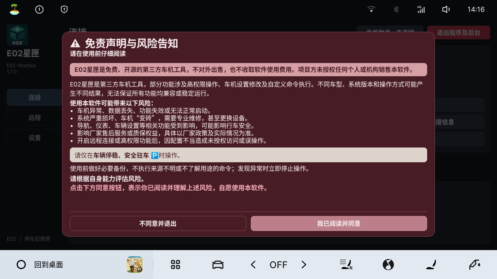
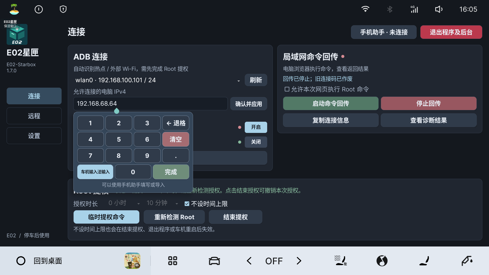
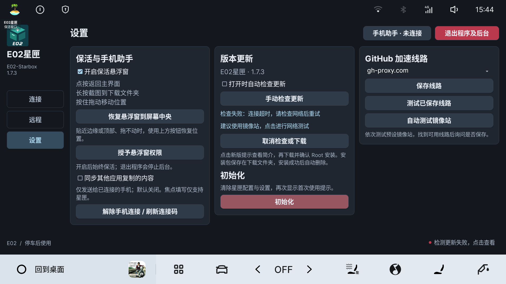

# E02星匣使用指南

适用于主要验证环境：2025 星舰 7 / E02、Flyme Auto 2.5.0、Android 9。请仅在车辆停稳、安全驻车时操作。

## 安装与第一次打开

从[发布页](https://github.com/BerryFuwawa/E02-StarBox/releases/tag/v1.7.4)下载 `E02-Starbox-v1.7.4.apk`，允许安装后打开。官方旧版可直接覆盖安装，已有设置保留；使用不同签名的自行编译版时不能直接覆盖。

首次打开显示「免责声明与风险告知」。同意后启动功能并保存确认，拒绝则退出程序及后台。再次打开不重复显示。

左侧固定「连接、远程、后台、设置」。顶部手机助手用于输入和复制；右上角红色「退出程序及后台」停止星匣的手机服务、命令回传、FRP、更新和悬浮窗，结束本次 Root 授权，保留当前系统 ADB 配置。

Root 提权位于上方；ADB 连接和局域网命令回传并排位于下方。

## 按目标查看教程

| 目标 | 操作教程 |
| --- | --- |
| 启用独立授权；填写长 Token；接收复制内容 | [Root 授权与手机助手](教程/Root授权与手机助手.md) |
| 局域网无线 ADB、有线 ADB、网页普通／Root 命令 | [ADB 与命令回传](教程/ADB与命令回传.md) |
| 车机与电脑不同网络，自建／第三方 FRP | [FRP 远程连接](教程/FRP远程连接.md) |
| 设置后台入口、自动连接与退出 | [后台与自动连接](教程/后台与自动连接.md) |
| 下载新版本，测试可用镜像站 | [版本更新](教程/版本更新.md) |

## 地址输入小键盘

点击电脑 IP、服务器地址、服务器端口或远程网页地址，会在输入框下方打开小数字键盘。提供数字、小数点、←退格、清空和完成；底行是「车机输入法输入 / 0 / 完成」。

默认不打开车机全屏输入法。需要输入域名或完整网址时，点击冰蓝色「车机输入法输入」，或使用手机助手填写。返回键优先关闭小键盘。

「完成」只关闭键盘：电脑 IP 仍需「确认并应用」，远程配置仍需「保存配置」。清空为红色、完成为绿色，底板和按钮有独立边框。

## 悬浮窗与截图

在「后台」开启「星匣后台保活」及其子项「保活悬浮窗」，需要系统允许悬浮窗。状态栏入口和悬浮窗可分别选择，与是否启动回传或 FRP 无关。关闭总开关会隐藏两项并记住选择；退出前请关闭总开关。「开机自启」不限制主动退出。

- 点按：回到星匣主界面。
- 长按：隐藏悬浮窗后截图，保存到下载文件夹，完成后提示结果。截图需要 Root 授权。
- 拖动：移动悬浮窗。

贴近屏幕边缘或顶部、被系统手势挡住而无法拖动时，点击「恢复悬浮窗到屏幕中央」。关闭悬浮窗只隐藏窗口，不停止其他已运行功能。

点击「授予悬浮窗权限」会尝试打开系统授权页；车机未提供标准入口时会显示说明，可到车机应用管理或权限管理处理。已有权限会提示无需再次授权。

## 检查更新

在「设置」开启或关闭「打开时自动检查更新」，也可点击「手动检查更新」。发现新版后，点击右下角提示查看更新内容，再选择「下载」。软件内更新前需要完成 Root 授权。

检查失败时，可在设置中自动测试镜像站，找到可用线路后选择是否使用。也可手动选择「GitHub 加速线路」或填写自定义 HTTPS 地址，再点击「保存线路」。

下载完成并校验通过后，确认安装。安装包保存在下载文件夹，安装成功后自动删除；已有设置保留。重新打开星匣后，按需恢复授权、网页和远程服务。

旧版点击安装闪退时，请先手动下载并覆盖安装 v1.7.4。详细步骤和界面示例见[版本更新](教程/版本更新.md)。

## 初始化

打开「设置 → 初始化」，阅读确认窗口。

确认后清除星匣配置、设置、连接码、缓存和首次使用确认记录，停止星匣后台及本次 Root 授权，然后关闭应用。重新打开会再次显示风险告知，需要重新配置和授权。取消则不执行。

只重置星匣，不恢复车机出厂设置、不改变系统 ADB 配置，也不删除下载文件夹里的截图。系统可能同时重置应用权限，重开后需重新检查。

## 常见问题

| 问题 | 先检查什么 |
| --- | --- |
| 安装后没有 Root | 在连接页启用独立授权；需要车机本机已有可用的 Root ADB，普通 ADB 并不满足这个条件 |
| 无线 ADB 绿灯但电脑连不上 | 状态表示车机设置；核对电脑实际 IP、确认并应用、热点隔离和电脑连接结果 |
| 无线 ADB 显示状态未知 | 检测失败或授权不可用，先重新检测；未知不等于已关闭 |
| 网页 Root 选项点不了 | 先停止回传；授权仍有效时直接勾选并启动，授权失效时重新授权；点击选项会提示下一步 |
| 手机扫码打不开 | 确认同一可互通网络，选择正确车机地址；手机助手不自动穿透 |
| 手机无法填写 EVCC 输入框 | 焦点填写只支持星匣；发送到车机剪贴板后在 EVCC 手动粘贴 |
| FRP 显示已连接但访问不到 | 查看所选代理是否启动成功，并确认电脑端 frpc、命令网页和 ADB 已启动 |
| 停止回传后旧网页不能用 | 旧连接码失效，重新启动并使用新的连接信息 |

## 免费开源与适用范围

本软件免费、开源，不对外出售，不收取软件使用费用，项目方未授权他人销售。其他车型、系统版本或设备限制可能影响运行。

[v1.7.4 更新说明](1.7.3更新说明.md) · [兼容性与使用须知](版本验证范围.md) · [反馈问题](https://github.com/BerryFuwawa/E02-StarBox/issues)
