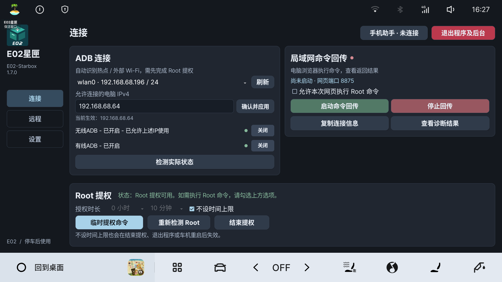
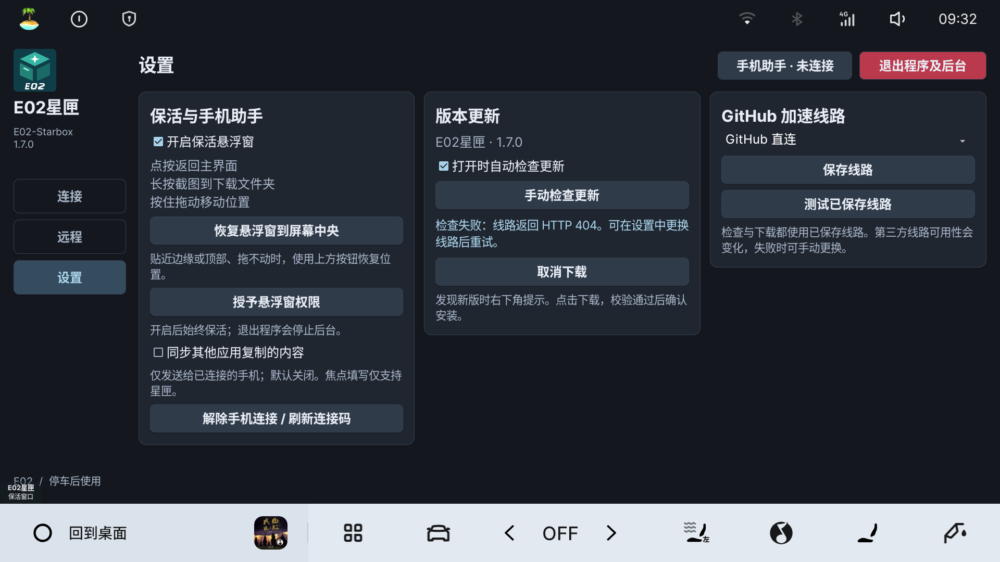

# E02星匣使用指南

适用于主要验证环境：2025 星舰 7 / E02、Flyme Auto 2.5.0、Android 9。请仅在车辆停稳、安全驻车时操作。

## 安装与第一次打开

从 [GitHub Release](https://github.com/BerryFuwawa/E02-StarBox/releases/tag/v1.7.0) 下载 `E02-Starbox-v1.7.0.apk`，允许安装后打开。原签名旧版可覆盖安装，已有配置保留；不同签名的自行编译版不能直接覆盖。

首次打开显示「免责声明与风险告知」。同意后启动功能并保存确认，拒绝则退出程序及后台。再次打开不重复显示。

左侧固定「连接、远程、设置」。顶部手机助手用于输入和复制；右上角红色「退出程序及后台」停止星匣的手机服务、命令回传、FRP、更新和悬浮窗，结束本次 Root 授权，保留当前系统 ADB 配置。

## 按目标查看教程

| 目标 | 操作教程 |
| --- | --- |
| 使用 EVCC 或应用管家授权；填写长 Token；接收复制内容 | [Root 授权与手机助手](教程/Root授权与手机助手.md) |
| 局域网无线 ADB、有线 ADB、网页普通／Root 命令 | [ADB 与命令回传](教程/ADB与命令回传.md) |
| 车机与电脑不同网络，自建／第三方 FRP | [FRP 远程连接](教程/FRP远程连接.md) |

## 地址输入小键盘

点击电脑 IP、服务器地址、服务器端口或远程网页地址，会在输入框下方打开小数字键盘。提供数字、小数点、←退格、清空和完成；底行是「车机输入法输入 / 0 / 完成」。

默认不打开车机全屏输入法。需要输入域名或完整网址时，点击冰蓝色「车机输入法输入」，或使用手机助手填写。返回键优先关闭小键盘。

「完成」只关闭键盘：电脑 IP 仍需「确认并应用」，远程配置仍需「保存配置」。清空为红色、完成为绿色，底板和按钮有独立边框。

## 悬浮窗与截图

设置中的「开启保活悬浮窗」默认开启，与是否启动回传或 FRP 无关，需要系统允许悬浮窗。

- 点按：回到星匣主界面。
- 长按：隐藏悬浮窗后截图，保存到下载文件夹，完成后提示结果。截图需要 Root 授权。
- 拖动：移动悬浮窗。

贴近屏幕边缘或顶部、被系统手势挡住而无法拖动时，点击「恢复悬浮窗到屏幕中央」。关闭悬浮窗只隐藏窗口，不停止其他已运行功能。

点击「授予悬浮窗权限」会尝试打开系统授权页；车机未提供标准入口时会显示说明，可到车机应用管理或权限管理处理。已有权限会提示无需再次授权。

## 检查更新

在「设置」开启或关闭「打开时自动检查更新」，也可点击「手动检查更新」。发现新版后右下角出现提示，点击下载；验证文件完整性、包名、版本和签名后询问是否安装。

「GitHub 加速线路」提供直连、五个预设与自定义 HTTPS 地址。保存后检查和下载使用所选线路；连接失败可换线路。自定义地址需支持在其后拼接完整 GitHub HTTPS 链接。第三方线路的可用性可能变化。

本版为 v1.7.0 / versionCode 10。已经安装同一 code 10 的本地修正版，不会因本次发布再次提示更新；需要时从 Release 手动下载覆盖安装。

## 初始化

打开「设置 → 初始化」，阅读确认窗口。

确认后清除星匣配置、设置、连接码、缓存和首次使用确认记录，停止星匣后台及本次 Root 授权，然后关闭应用。重新打开会再次显示风险告知，需要重新配置和授权。取消则不执行。

只重置星匣，不恢复车机出厂设置、不改变系统 ADB 配置，也不删除下载文件夹里的截图。系统可能同时重置应用权限，重开后需重新检查。初始化实际清除流程尚未为测试而清空用户车机配置，见[验证范围](版本验证范围.md)。

## 常见问题

| 问题 | 先检查什么 |
| --- | --- |
| 安装后没有 Root | 安装不授予 Root；用已有 Root 能力的 EVCC 或应用管家执行临时授权命令，再重新检测 |
| 无线 ADB 绿灯但电脑连不上 | 状态表示车机设置；核对电脑实际 IP、确认并应用、热点隔离和电脑连接结果 |
| 无线 ADB 显示关闭但 FRP ADB 可用 | 换网后可能暂停局域网电脑访问，保留 FRP 通道；不是电脑直连成功 |
| 网页 Root 选项点不了 | 先停止回传、检测有效授权、勾选后重新启动；点击选项会提示下一步 |
| 手机扫码打不开 | 确认同一可互通网络，选择正确车机地址；手机助手不自动穿透 |
| 手机无法填写 EVCC 输入框 | 焦点填写只支持星匣；发送到车机剪贴板后在 EVCC 手动粘贴 |
| FRP 显示已连接但访问不到 | 查看所选代理是否启动成功，并确认电脑端 frpc、命令网页和 ADB 已启动 |
| 停止回传后旧网页不能用 | 旧连接码失效，重新启动并使用新的连接信息 |

## 免费开源与适用范围

本软件免费、开源，不对外出售，不收取软件使用费用，项目方未授权他人销售。其他车型、系统版本或设备限制可能影响运行。

[更新说明](1.7.0更新说明.md) · [版本验证范围](版本验证范围.md) · [反馈问题](https://github.com/BerryFuwawa/E02-StarBox/issues)
