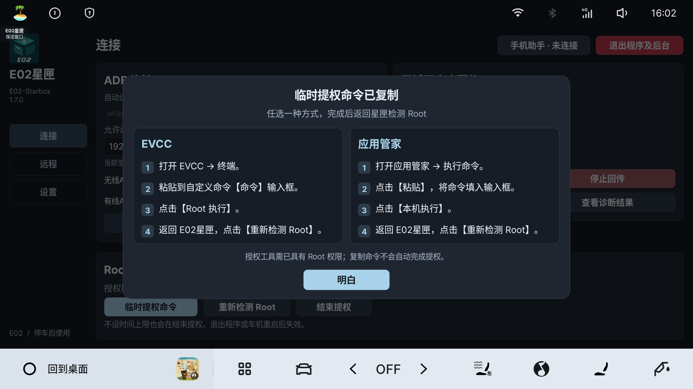
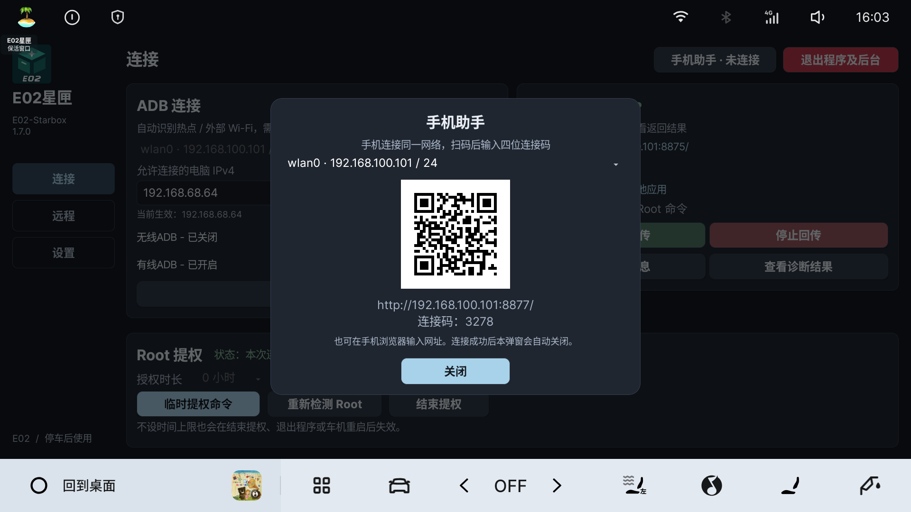

# Root 授权与手机助手

[返回使用指南](../使用指南.md)

## 授权 Root

手机输入和普通命令回传不需要 Root。修改 ADB、屏幕截图和网页 Root 命令需要有效授权。以下两种方式任选其一；授权工具本身需能执行 Root 命令。

1. 打开星匣「连接」，选择小时、分钟，或勾选「不设时间上限」。
2. 点击「临时提权命令」，成功复制后会显示操作步骤。
3. **EVCC：打开 EVCC → 终端 → 粘贴到自定义命令【命令】输入框 → 点击 Root 执行。**
4. **应用管家：打开应用管家 → 执行命令 → 点击粘贴 → 点击本机执行。**
5. 返回 **E02星匣 → 点击重新检测 Root**。检测成功后状态显示绿色。

复制命令不等于授权成功。计时从授权命令成功执行后开始；修改时长后，需要重新复制并执行命令。

「不设时间上限」只取消当前授权的计时。**结束提权、退出程序及后台、车机重启后仍会失效**，不会让星匣成为永久 Root 应用。

需要撤销时点击「结束提权」，确认后停止本次授权与命令回传；取消则保留。系统当前 ADB 设置保留。

## 用手机填写长 Token 和配置

1. 手机与车机连接同一可互通网络。
2. 点击星匣顶部「手机助手」，选择手机能访问的车机地址。
3. 手机扫码打开浏览器，输入弹窗显示的四位连接码。连接码有效期 10 分钟，一次仅连接一台手机。
4. 配对成功后车机二维码弹窗自动关闭；再次点击顶部入口提示「已连接」。手动关闭弹窗不会断开手机服务。
5. 在车机点击需要填写的输入框，例如「远程 → Token」。手机页面会显示当前目标。
6. 手机粘贴内容，点击「粘贴到焦点」，确认两端提示已填写。远程配置仍需在车机点击「保存配置」；电脑 IP 仍需「确认并应用」。

「粘贴到焦点」只填写星匣自己的输入框。向 EVCC 或应用管家填写时，手机点击「发送到车机剪贴板」，再到对应应用手动粘贴。

## 接收车机复制内容

星匣复制的命令或配置会显示在手机「接收车机复制内容」区域。Token 和密钥默认遮罩，需要时主动展开。

接收 EVCC 等其他应用复制的内容：在星匣「设置」开启「同步其他应用复制的内容」，然后在对应应用点击复制。该选项默认关闭。

手机点击「复制到手机」。浏览器不支持一键复制时，点击「选中文本」，再长按复制。最多传输 65536 个字符，不保存传输历史。

## 无法连接或填错目标怎么办

- 二维码打不开：确认手机与车机能互相访问；热点的客户端隔离可能阻止访问。
- 没有输入框：先在星匣点击需要填写的输入框，保持星匣在前台。
- 提示输入框已切换：确认手机显示的目标后重新发送。
- 连接码过期或已有其他手机：在「设置」点击「解除手机连接 / 刷新连接码」，重新扫码配对。
- 车机切换网络：重新打开手机助手，使用新的地址；手机助手仅用于局域网，不自动通过 FRP 转发。
