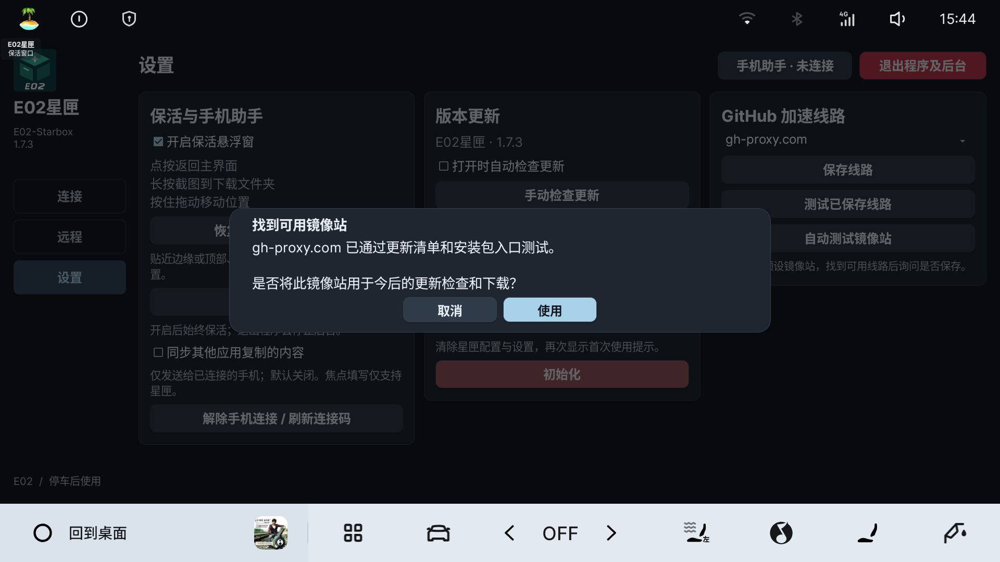
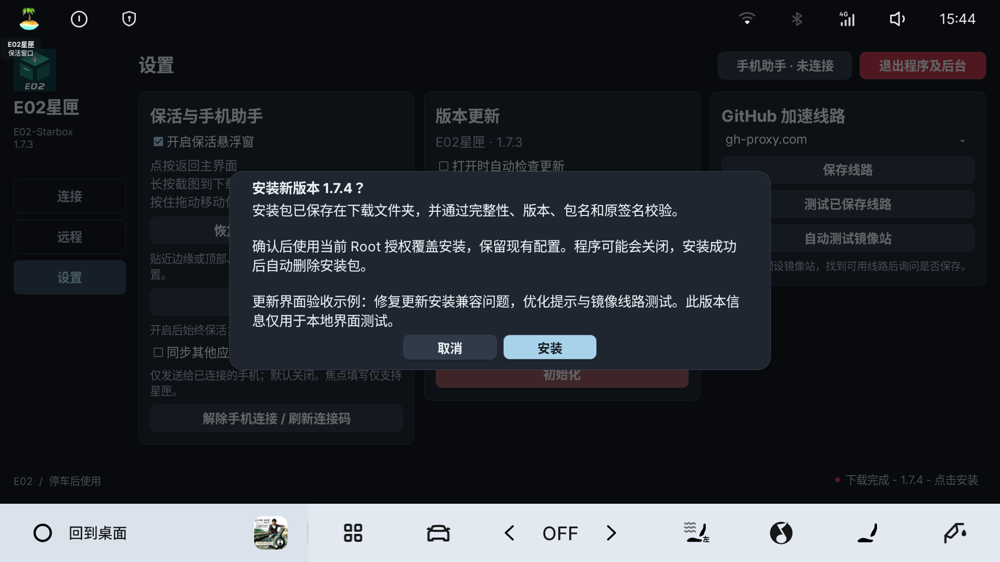

# 版本更新

以下适用于 v1.7.3 及之后的更新界面。从 v1.7.2 及更早版本升级时，建议先下载本版 APK，通过 EVCC 或应用管家覆盖安装一次；旧版在部分 Flyme Auto 上无法打开安装权限页面，可能闪退。

## 检查与下载

打开星匣后按设置自动检查。发现新版时，右下角显示红点和“发现更新 - 版本号 - 点击查看”；已是最新版时不显示提醒。也可在设置点击“手动检查更新”。

点击提示查看更新简介，再点击“下载”。下载前需要完成Root提权；按连接页复制命令，在EVCC或应用管家中以Root执行，再返回重新检测。

安装包保存在车机下载文件夹。下载完成并通过校验后，点击“安装”确认使用当前Root授权覆盖安装。安装时程序可能关闭，完成后重新打开；原配置保留，安装成功后自动删除对应安装包。

取消安装会保留完整安装包，稍后可点击右下角继续。安装失败同样保留文件；取消下载或下载校验失败会清理此次临时文件。不会清理下载文件夹中的其他文件。

## 检查失败与镜像站

右下角显示“检测更新失败，点击查看”时，点击进入设置。选择“建议使用镜像站，点击进行网络测试”，或点击“自动测试镜像站”。

程序依次测试五个预设镜像站，找到第一条可用线路后停止，并询问是否用于今后的更新检查和下载。点击“使用”才保存，点击“取消”保留原线路；测试过程中可取消。

也可手动选择线路或填写自定义HTTPS域名，再点击“保存线路”。线路测试只说明当前可访问更新清单和安装包入口；正式下载仍会检查安装包大小、SHA-256、包名、版本和原签名。

## 常见情况

- **Root不可用**：先重新提权，软件不会自动申请Root或修改系统权限。
- **下载失败**：检查网络、切换可用镜像站后重试。
- **安装未完成**：保留的安装包可重试；重新打开后以软件显示的实际版本为准。
- **安装完成但文件未删除**：按提示在下载文件夹手动删除对应星匣安装包。
- **远程连接中断**：覆盖安装可能停止星匣服务，重新打开后按需启动远程连接。

## 界面示例

下面是车机原始截图，没有重绘或模糊处理。检查失败状态和 1.7.4 安装弹窗用于界面验收示例，1.7.4 不代表已发布版本；镜像站成功提示来自实际网络测试。

