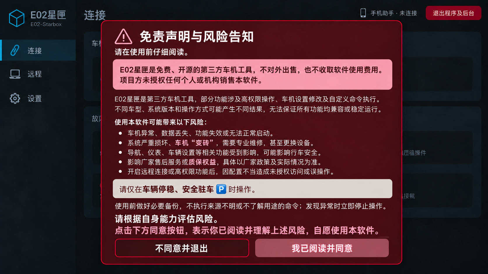

# 首次启动风险告知弹窗

截至2026-10-06：以下文案和样式来自用户最终指示；最新概念图已生成，最终视觉确认与实车行为验收待完成。`RiskNotice.java` 和主Activity接入已编译，尚未安装到车机。

## 文案原文

# 免责声明与风险告知

**请在使用前仔细阅读**

E02星匣是免费、开源的第三方车机工具，不对外出售，也不收取软件使用费用。项目方未授权任何个人或机构销售本软件。

E02星匣是第三方车机工具，部分功能涉及高权限操作、车机设置修改及自定义命令执行。不同车型、系统版本和操作方式可能产生不同结果，无法保证所有功能均兼容或稳定运行。

**使用本软件可能带来以下风险：**

- 车机异常、数据丢失、功能失效或无法正常启动。
- 系统严重损坏、车机“变砖”，需要专业维修，甚至更换设备。
- 导航、仪表、车辆设置等相关功能受到影响，可能影响行车安全。
- 影响厂家售后服务或质保权益，具体以厂家政策及实际情况为准。
- 开启远程连接或高权限功能后，因配置不当造成未授权访问或误操作。

请仅在**车辆停稳、安全驻车 🅿️**时操作。

使用前做好必要备份，不执行来源不明或不了解用途的命令；发现异常时立即停止操作。

**请根据自身能力评估风险。**

**点击下方同意按钮，表示你已阅读并理解上述风险，自愿使用本软件。**

按钮：**不同意并退出**、**我已阅读并同意**。

## 布局与样式

| 区域 | 已确认要求 |
| --- | --- |
| 外层 | 深红/酒红圆角弹窗、细红边框、背景压暗；沿用现有Logo和页面 |
| 顶部 | 警告图形、标题、阅读提示 |
| 免费声明 | 独立浅红圆角框，深色文字，完整保留免费开源不出售及未授权销售说明 |
| 风险正文 | 浅色文字，五条完整显示 |
| 驻车提醒 | 浅暖灰圆角框，仅一句“请仅在车辆停稳、安全驻车 🅿️时操作。”；重点短语加粗，🅿️紧随安全驻车 |
| 备份说明 | 移到驻车框下，普通正文，无框 |
| 风险评估 | 浅色、加粗 |
| 同意说明 | 浅红、加粗 |
| 底部 | 左拒绝退出、右同意，等高对齐、完整可触控 |

不添加其他法律句、倒计时或复选框。文案不得由概念图OCR反推，名称应准确使用“星匣”。空间不足时内容可滚动，但底部按钮保持可见；1080P最终排版以实车为准。

## 行为与当前实现

`RiskNotice.accepted()`读取独立`risk_notice/acceptedVersion`，当前文案版本为1。原配置未自动视为同意，所以旧安装升级到此候选版后也需首次确认。该行为来自当前实现，尚需运行验证。

同意按钮先同步保存确认状态，失败显示提示且不关闭；成功后关闭弹窗并启用后台服务与更新检查。拒绝调用既有“退出程序及后台”路径。当前Dialog不允许点击外部或返回键绕过确认。

主Activity在`onCreate`、`onResume`、`onNewIntent`增加确认检查。服务启动移到只执行一次的`startApprovedServices()`；主界面构造期间只读取原偏好，准备授权脚本已移到同意之后。Activity销毁时会关闭持有的风险Dialog，避免遗留窗口。

手机助手启动、ADB自动维护、ConsoleService、RemoteService及UpdateService分别检查确认状态。拒绝退出时，即使尚未准备授权脚本，也会读取原有本机授权token以停止可能残留的授权进程。以上路径已离线编译核对，Android运行时及实车结果待用户返回后验证。

待测：首次启动、拒绝退出、同意保存、重复启动、返回前台、配置保留、遮挡/滚动/字形、已有Root服务的停止，以及后台服务在确认前后时序。

## 概念预览

以下是内置imagegen生成的概念图，供布局/配色审阅，不是实车截图。

## 2026-10-06 最终开发与实车补充

用户已确认最新概念并授权开发。风险弹窗现已按图实现、原签名覆盖安装；首次确认、拒绝退出、同意保存、再次启动、配置保留及普通/Root回传通过。文案与按钮在1080P同屏可见，不遮挡系统底栏。前文“未安装/待确认”指历史候选；当前结果见[风险弹窗实车验收](风险弹窗实车验收.md)。最新同批交付在D:/Codex/OUT/20261006-E02-StarBox-1.7.0。GitHub仍未上传。
